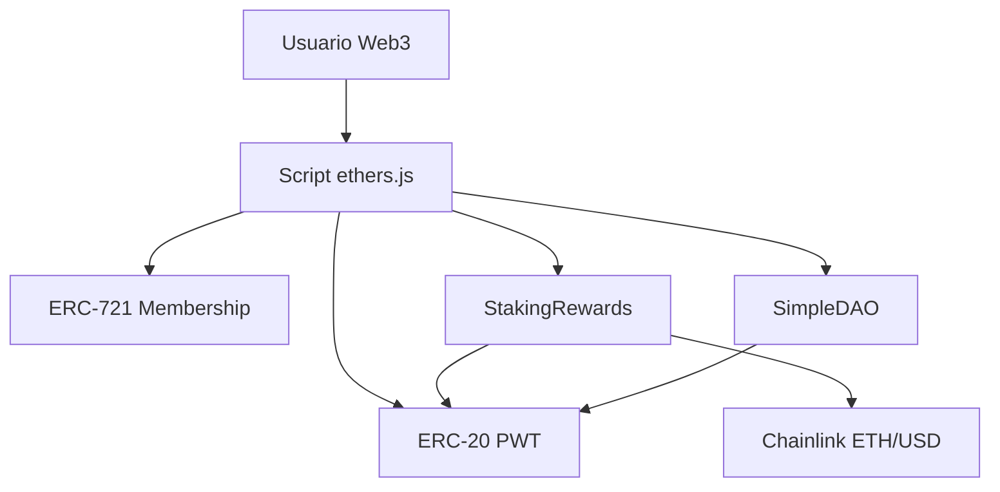

# Protocolo Web3 Completo com Deploy em Testnet

MVP de protocolo descentralizado para a atividade da Unidade 1, Capitulo 5.

## Componentes

- Token ERC-20: `ProtocoloToken.sol`
- NFT ERC-721: `ProtocoloNFT.sol`
- Staking com recompensa: `StakingRewards.sol`
- Governanca simples: `SimpleDAO.sol`
- Oraculo Chainlink ETH/USD na Sepolia
- Scripts Web3 com `ethers.js`

## Arquitetura



## Como Rodar

```bash
npm install
npm run compile
npm test
```

Crie o arquivo `.env` usando `.env.example` como modelo.

Deploy:

```bash
npm run deploy:sepolia
```

Interacao:

```bash
npm run interact:sepolia
```

## Enderecos dos Contratos

Preencher apos deploy:

- ProtocoloToken:
- ProtocoloNFT:
- StakingRewards:
- SimpleDAO:
- Explorer:
